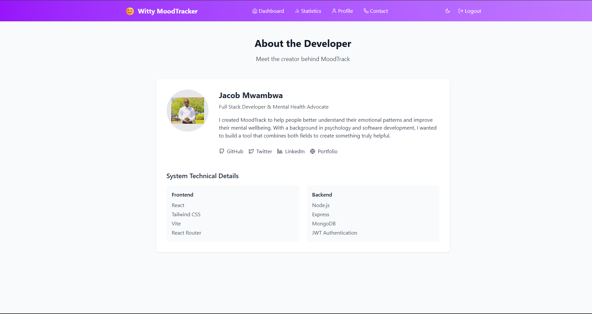

# 😄 MOODTRACKER

**A Personal Mood Tracking Application**

[](https://mood-tracker-git-main-jacobkaus-projects.vercel.app/)

---

## 📸 Screenshots

  


---

## 📋 Table of Contents

- [Features](#features)
- [Technologies](#technologies)
- [Installation](#installation)
- [Configuration](#configuration)
- [Usage](#usage)
- [API Endpoints](#api-endpoints)
- [Deployment](#deployment)
- [Monitoring & Maintenance](#monitoring--maintenance)
- [Contributing](#contributing)
- [License](#license)
- [CI/CD Status](#cicd-status)
- [Related Links](#related-links)

---

## ✨ Features

- 📊 **Comprehensive Mood Tracking** – Log your emotions and reflect on trends.
- 🔒 **Secure Authentication** – JWT-based login system with bcrypt password hashing.
- 🎨 **Personalization** – Customizable profiles and themes.
- 📈 **Data Insights** – Visualize mood data over time with intuitive charts.

---

## 🛠️ Technologies

### ⚛️ Frontend
- React 18, Vite, Tailwind CSS
- React Router v6, Axios, Chart.js

### 🔧 Backend
- Node.js, Express, MongoDB, Mongoose
- JWT, Bcrypt, Helmet, Morgan

### ⚙️ DevOps
- GitHub Actions (CI/CD)
- Vercel (Frontend), Render (Backend)
- MongoDB Atlas (Cloud DB)

---

## 🧰 Installation

```bash
git clone https://github.com/yourusername/moodtracker.git
cd moodtracker
```

### 📦 Backend Setup

```bash
cd server
npm install
```

### 🎨 Frontend Setup

```bash
cd ../client
npm install
```

---

## ⚙️ Configuration

Create `.env` files using the examples provided.

### `server/.env`

```env
PORT=5000
MONGO_URI=your_mongodb_atlas_url
JWT_SECRET=your_jwt_secret_key
JWT_EXPIRE=30d
EMAIL_USER=your_email@gmail.com
EMAIL_PASS=your_email_password
```

### `client/.env`

```env
VITE_API_BASE_URL=https://your-backend-api-url.com
```

Check `.env.example` files for templates.

---

## ▶️ Usage

```bash
# Start backend
cd server
npm run dev

# Start frontend
cd ../client
npm run dev
```

Visit: [http://localhost:5173](http://localhost:5173)

---

## 📡 API Endpoints

| Endpoint               | Method | Description                |
|------------------------|--------|----------------------------|
| `/api/auth/register`  | POST   | User registration          |
| `/api/auth/login`     | POST   | User login                 |
| `/api/auth/me`        | GET    | Get current user profile   |
| `/api/auth/health`    | GET    | Health check route         |
| `/api/moods`          | GET    | Get all moods for user     |
| `/api/moods`          | POST   | Create new mood entry      |
| `/api/moods/:id`      | DELETE | Delete mood entry          |
| `/api/moods/stats`    | GET    | Get mood statistics        |
| `/api/profile`        | PUT    | Update user profile        |

---

## 🚀 Deployment

### ✅ Frontend: **Vercel**

🌐 [Live App](https://mood-tracker-git-main-jacobkaus-projects.vercel.app)

- Auto-deploys from GitHub `main` branch  
- HTTPS + caching enabled

### ✅ Backend: **Render**

🌐 [Live API](https://moodtracker-api.onrender.com)

- GitHub auto-deploy + environment variables
- Logging with Morgan, security via Helmet

---

## 🧑‍🔧 Monitoring & Maintenance

- **Health Check**: `/api/auth/health` endpoint monitored by UptimeRobot
- **Logging**: Express error handlers + Morgan middleware
- **Error Tracking**: Ready for integration with Sentry
- **Maintenance**:
  - Weekly security updates
  - Daily MongoDB Atlas backups
  - Deployment rollbacks via GitHub history
  - CI tests on all pushes to main

---

## 🤝 Contributing

1. 🍴 Fork this repo
2. 🛠 Create a feature branch:  
   `git checkout -b feature/YourFeatureName`
3. 💬 Commit your changes:  
   `git commit -m "Add your message"`
4. 🚀 Push to the branch:  
   `git push origin feature/YourFeatureName`
5. 🔁 Create a Pull Request

---

## 📄 License

This project is licensed under the **MIT License**.  
See the [LICENSE](./LICENSE) file for details.

---

## 🧪 CI/CD Status

GitHub Actions run tests and lint the codebase on every push to `main`.

Check `.github/workflows/ci.yml` for configuration.

---

## 🔗 Related Links

- 🌐 **Frontend**: [https://mood-tracker-git-main-jacobkaus-projects.vercel.app](https://mood-tracker-git-main-jacobkaus-projects.vercel.app)
- 🌐 **Backend**: [https://moodtracker-api.onrender.com/api](https://moodtracker-api.onrender.com/api)